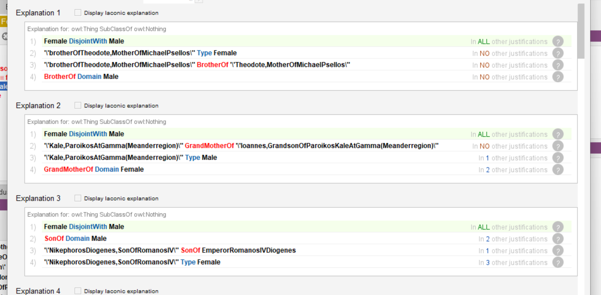
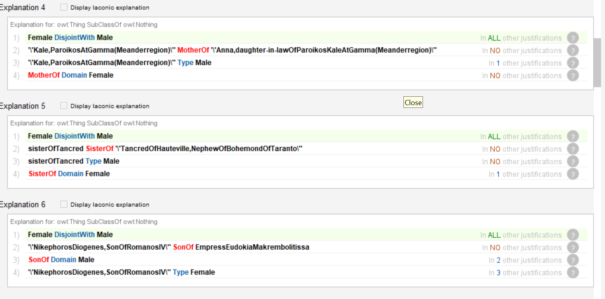
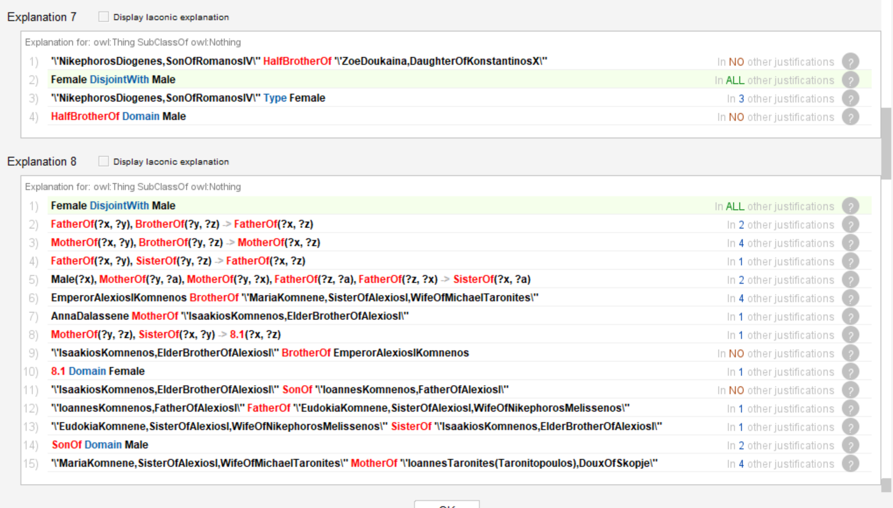
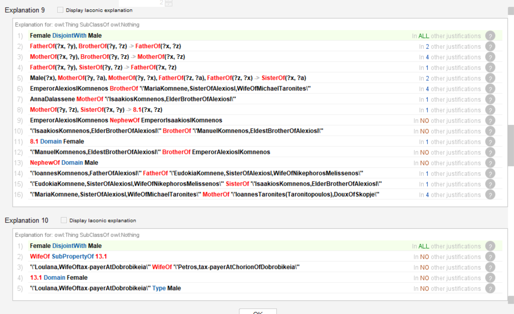
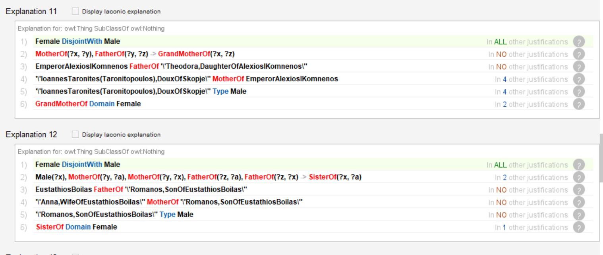
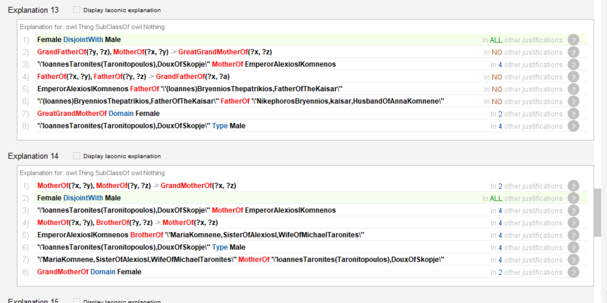
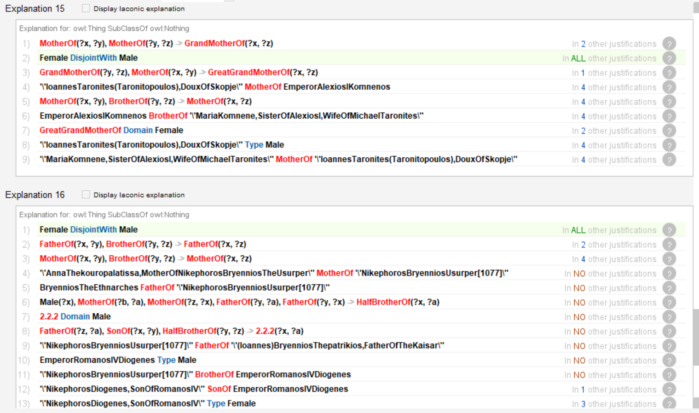
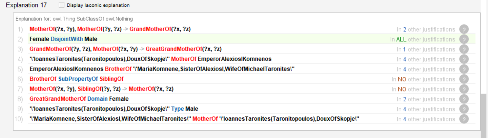

[TOC]
# Structure 
MS_thesis/
├── code/
│   ├── data/
│   ├── out/
│   ├── main.py
│   └── README.md
├── assets/
├── requaierments.txt
├── README.md

# General information 
This repo takes data from RELEVEN project regarding relations. After cleaning data is loaded to protege using relation ontology. 
After that reasoner is run to check data coherence. 

# Important notes
1. Mapping between relation used in RELEVEN database and used ontology is done by ChatGPT 4o. 
2. Reasoner explanation is not full it is a partial results after 12h of running.

# Result 

Most of this errors are cause by wrong gender with itself is an important finding.